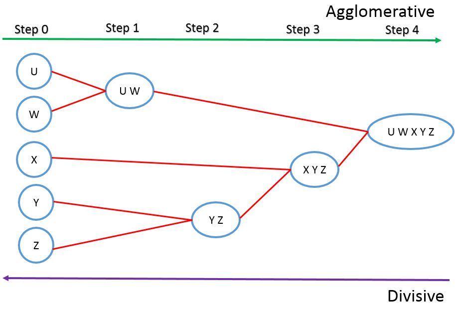
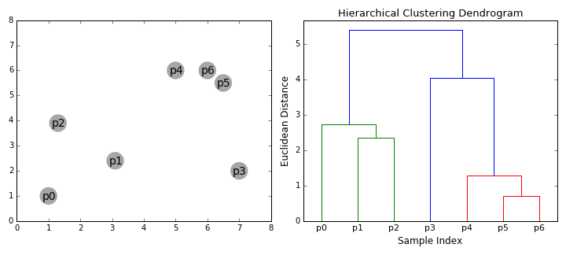
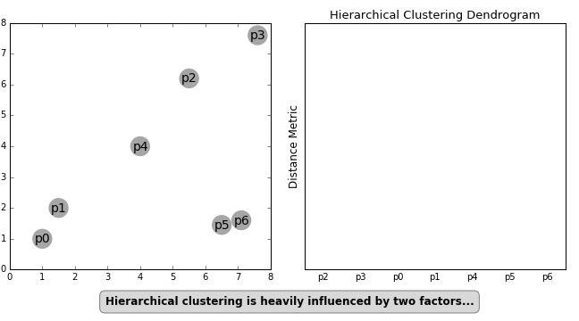
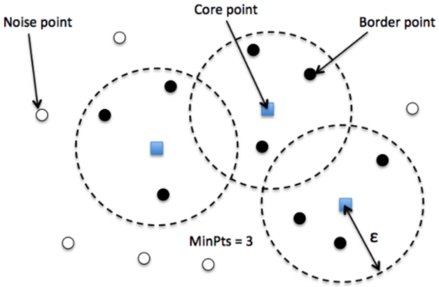
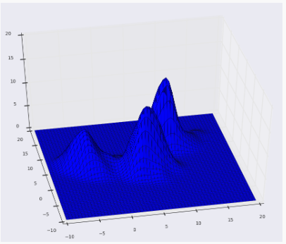
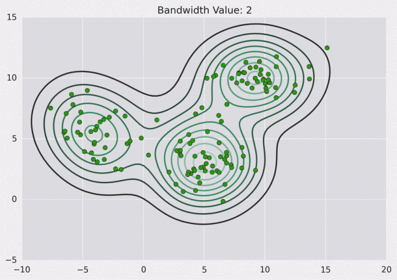
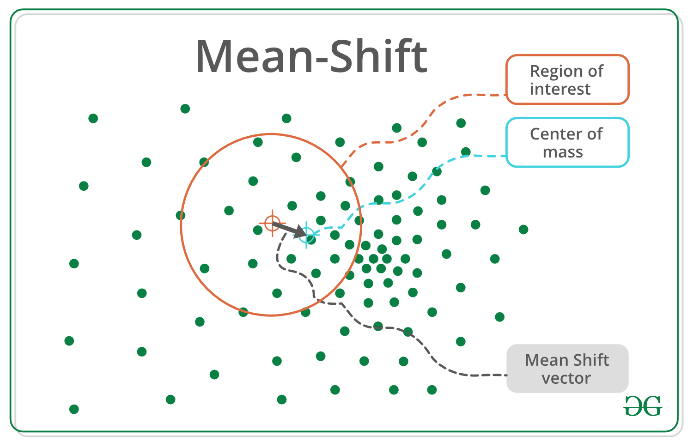

[TOC]

# Literature search and pipeline planning

## Project details

**Project number**: J7 

**Project name**: Deep Clustering for Unsupervised Image Classification

**Dataset**: GTSRB - German Traffic Sign Recognition Benchmark

**Team member**: Besson Sacha; Capdeville Jérémie; Arriagada Silva Sebastián Ignacio; Mei Jiaojiao;

## Dataset exploration

### class imbalance

Number of images in each class：

common techniques for dealing with imbalanced data like:

- Class weighting
- Oversampling

### information from columns

Meta.csv

Test.csv

train.csv

### Correlation Matrix

Meta.csv

Test.csv

Train.csv

### scatter and density plot

Meta.csv

Test.csv

Train.csv

## Machine learning Clustering techniques

### Hierarchical clustering

####  Agglomerative or Divisive

**Algorithm 1 Agglomerative clustering.**

Input: Initialize the number of clusters to be formed.
Output: Clustered data.
Consider each data point as a cluster;
while clustering condition is not satisfied do
Perform merging of two clusters having minimum inter-cluster distance; end while

**Algorithm 2 Divisive clustering**

Input: Initialize the number of clusters to be formed.
Output: Clustered data.
Consider all data points as a single cluster;
while clustering condition is not satisfied do
Divide the cluster into two clusters resulting in the largest inter-cluster distance; end while

#### Linkage

This technique is used for combining two clusters. Note that it’s the distance between clusters, and not individual observation.

### Kmeans

the process:

- Step 1: Partition the items into $K$ initial clusters.
- Step 2: Scan through the list of $n$ items, assigning each item to the cluster whose centroid (mean) is closest. Each time an item is reassigned, we recalculate the cluster mean or centroid for the cluster receiving that item and the cluster losing that item.
- Step 3: Repeat Step 2 over and over again until no more reassignments are made.

### DBscan

#### parameters

The DBSCAN algorithm uses two parameters:
- minPts: The minimum number of points (a threshold) clustered together for a region to be considered dense.
- eps $(\boldsymbol{\varepsilon})$ : A distance measure that will be used to locate the points in the neighborhood of any point.

#### core、border and noise

1. **Core** — This is a point that has at least *m* points within distance *n* from itself.
2. **Border** — This is a point that has at least one Core point at a distance *n*.
3. **Noise** — This is a point that is neither a Core nor a Border. And it has less than *m* points within distance *n* from itself.

**Algorithmic steps for DBSCAN clustering**:

- The algorithm proceeds by arbitrarily picking up a point in the dataset (until all points have been visited).
- If there are at least 'minPoint' points within a radius of ' $\varepsilon$ ' to the point then we consider all these points to be part of the same cluster.
- The clusters are then expanded by recursively repeating the neighborhood calculation for each neighboring point

### Expectation Maximisation

Algorithm:
1. Given a set of incomplete data, consider a set of starting parameters.
2. Expectation step (**E** - step): Using the observed available data of the dataset, estimate (guess) the values of the missing data.
3. Maximization step ( $\mathbf{M}$ - step): Complete data generated after the expectation (E) step is used in order to update the parameters.
4. Repeat step 2 and step 3 until convergence.

### Mean shift

Mean-shift builds upon the concept of kernel density estimation, in short KDE. Imagine that the above data was sampled from a probability distribution. KDE is a method to estimate the underlying distribution also called the probability density function for a set of data.

It works by placing a kernel on each point in the data set. A kernel is a fancy mathematical word for a weighting function generally used in convolution. There are many different types of kernels, but the most popular one is the Gaussian kernel. Adding up all of the individual kernels generates a probability surface example density function. Depending on the kernel bandwidth parameter used, the resultant density function will vary.

Below is the KDE surface for our points above using a Gaussian kernel with a kernel bandwidth of 2.

## Deep learning clustering techniques

[Semantic Clustering by Adopting Nearest neighbors (SCAN) algorithm.][https://colab.research.google.com/github/keras-team/keras-io/blob/master/examples/vision/ipynb/semantic_image_clustering.ipynb#scrollTo=5MuGpG6h2HLt]

[Image Classification & Clustering step by step][https://www.kaggle.com/code/naim99/image-classification-clustering-step-by-step]

[imagecluster](https://elcorto.github.io/imagecluster/index.html)

https://github.com/HandsomeBrotherShuaiLi/ImageCluster

https://github.com/tringn/image_clustering

https://github.com/alianoroozi/Image-Clustering

## Evalution metrics

Notice that there are a few metrics defined above that can be computed by the model that will be helpful when evaluating the performance.
- False negatives and false positives are samples that were incorrectly classified
- True negatives and true positives are samples that were correctly classified
- Accuracy is the percentage of examples correctly classified $>\frac{\text { true samples }}{\text { total samples }}$
- Precision is the percentage of predicted positives that were correctly classified $>\frac{\text { true positives }}{\text { true positives }+\text { false positives }}$
- Recall is the percentage of actual positives that were correctly classified $>\frac{\text { true positives }}{\text { true positives }+\text { false negatives }}$
- AUC refers to the Area Under the Curve of a Receiver Operating Characteristic curve (ROC-AUC). This metric is equal to the probability that a classifier will rank a random positive sample higher than a random negative sample.
- AUPRC refers to Area Under the Curve of the Precision-Recall Curve. This metric computes precision-recall pairs for different probability thresholds.

## Plan

1. Hierarchical clustering
2. Kmeans
3. DBscan
4. EM
5. Mean shift

try above mentioned clustering algorthms based deep learning neural networks and make a comparison of their performances

**The whole experimental process is like**:

Each one finds a related neural network example code and implemente it with our imbalanced data, and evaluate your performance, at last we can merge our results and make a comparion.

- Decide what kind of clustering method you want to use
- find related neural network
- find a way to solve imbalanced data
- Implement the neural network you find and then make some modifications based on your appetite 
- Training
- Testing
- calculate accuracy, percision and AUC
- do some data visulization work

and we discuss our results together and write a report.